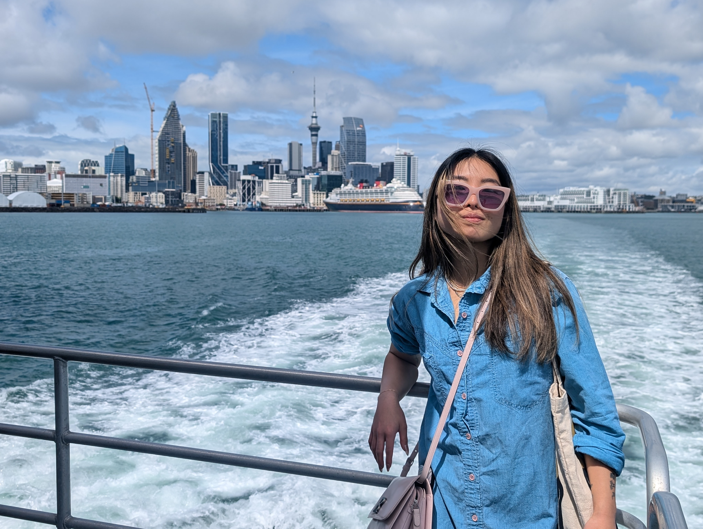

I write about responsible AI, tech minimalism, and our relationship with technology.
---

I have always enjoyed big picture thinking and the future, about the long-term trends and forces that are shaping our world. Prior to my career as a software engineer, I spent a few years working in medical diagnostics. Being a frontline witness to the many inefficiencies in the healthcare system sparked my interest in the intersection of technology and human wellbeing.

Working in AI has driven me into soul searching on how to design and build technology that is nourishing and healing. 

---
I appreciate information delivered in simple and effective formats.

---

I can be reached at me<<at>>bronteli.com.
Find me on LinkedIn [here](https://www.linkedin.com/in/brontesihanli/).

<figure>
  
</figure>
